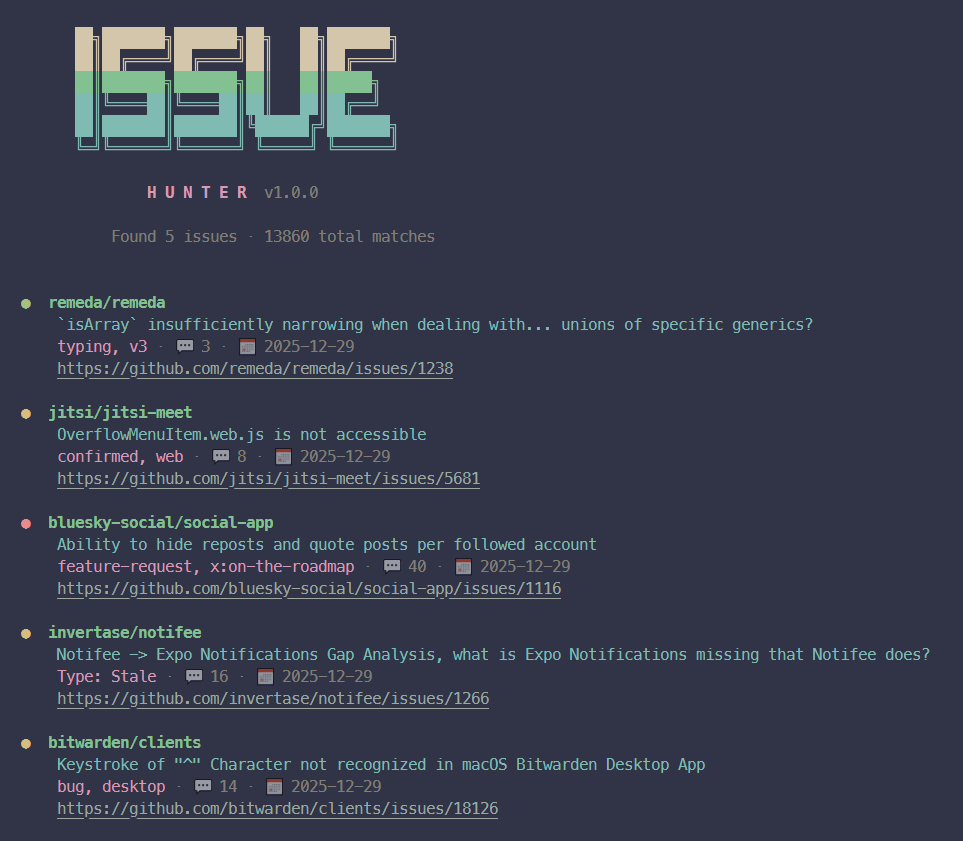

# IssueHunter CLI
A professional CLI tool to find GitHub issues relevant for contribution based on your developer profile.




## ✨ Features

- 🔍 **Global Search** - Search GitHub issues across all public repositories
- 🏷️ **Smart Filtering** - Filter by labels, language, user, repository
- 🤖 **Bot Filtering** - Automatically excludes bot-created issues
- 🎨 **Beautiful Output** - Professional tables with color coding
  - 🟢 Green: Low activity (< 5 comments)
  - 🟡 Yellow: Medium activity (5-20 comments)
  - 🔴 Red: High activity (> 20 comments)
- 🔗 **Clickable URLs** - Click issue titles to open in browser (in supported terminals)
- 📊 **Multiple Formats** - Table, list, or JSON output
- 🎯 **User-Specific** - Find issues in your repos, created by you, or involving you
- ⚡ **Preset Commands** - Quick searches for dev tools, CLI, plugins, .NET, automation

## Installation

```bash
npm install
```

## Usage

### Basic Search

```bash
# Show help
node cli.js --help

# Search issues in your repositories
node cli.js search --user ruslanlap

# Search issues you created
node cli.js search --author ruslanlap

# Search issues where you're involved
node cli.js search --involves ruslanlap

# Search specific repository
node cli.js search --repo microsoft/PowerToys

# Search with specific language
node cli.js search --language typescript --label "help wanted"

# Search with keyword
node cli.js search --keyword "cli automation"

# Output as JSON
node cli.js search --user ruslanlap --format json

# Output as list
node cli.js search --user ruslanlap --format list
```

### Preset Commands

```bash
# Developer tools related issues
node cli.js devtools

# CLI tools related issues
node cli.js cli

# Plugin-related issues (PowerToys, VS Code, etc.)
node cli.js plugins

# .NET related issues
node cli.js dotnet

# Automation tools related issues
node cli.js automation
```

### Options

| Option | Description |
|--------|-------------|
| `--user <user>` | Search issues in this user's repositories |
| `--repo <owner/repo>` | Search issues in specific repository |
| `-u, --username <username>` | GitHub username to exclude own repos (default: ruslanlap) |
| `-a, --author <author>` | Find issues created by this user |
| `-i, --involves <user>` | Find issues where user is involved |
| `--mentions <user>` | Find issues that mention this user |
| `--assignee <user>` | Find issues assigned to this user |
| `-l, --language <language>` | Filter by programming language |
| `-k, --keyword <keyword>` | Search keyword |
| `--label <label>` | Filter by single label |
| `-n, --per-page <number>` | Number of results (default: 30) |
| `-f, --format <format>` | Output format: table, list, json (default: table) |
| `--include-own` | Include issues from your own repositories |
| `--no-exclude-bots` | Include bot-created issues |
| `--urls` | Show direct URLs at the end |
| `-t, --token <token>` | GitHub personal access token |

### Authentication

For higher rate limits, set your GitHub token:

```bash
export GITHUB_TOKEN=your_token_here
```

Or pass it directly:

```bash
node cli.js search --token your_token_here
```

## Search Query Details

The tool builds GitHub search queries with:
- `is:issue is:open is:public` - Only open issues
- `-user:ruslanlap` - Excludes your own repositories
- Label filters with OR logic
- Language and keyword filters

## Output Formats

### List (default)
```
📋 Found 15 issues:

1. microsoft/PowerToys
   [Bug] Run plugin not loading on startup
   https://github.com/microsoft/PowerToys/issues/12345
   Labels: bug, help wanted | Comments: 3 | Updated: 2025-12-29
```

### Table
Formatted ASCII table with columns for Repository, Title, Labels, Comments, Updated.

### JSON
```json
[
  {
    "repository": "microsoft/PowerToys",
    "title": "[Bug] Run plugin not loading on startup",
    "url": "https://github.com/microsoft/PowerToys/issues/12345",
    "labels": ["bug", "help wanted"],
    "comments": 3,
    "updated": "2025-12-29"
  }
]
```

## License

MIT
